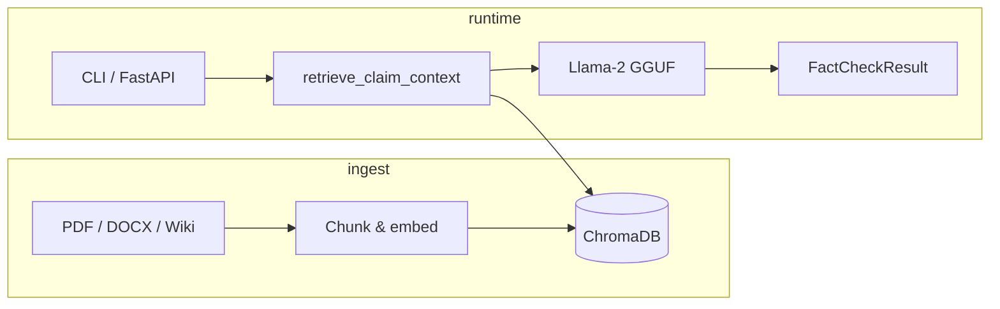

# PaleoFactCheck

**Local RAG fact-checking for paleontology claims** — retrieve evidence from a Chroma vector store, reason with a local Llama-2 GGUF model, and return structured verdicts (`True` / `False` / `Insufficient information`).

No cloud API required. Documents stay on your machine.

---

## Highlights

| Area | What you get |
|------|----------------|
| **Retrieval** | Sentence-transformer embeddings + ChromaDB over PDFs, DOCX, and Wikipedia sources |
| **Inference** | Lazy-loaded Llama-2 via `llama-cpp-python` (model loads on first check, not at import) |
| **CLI** | `python main.py` with `--top-k` and optional `--build-dataset` |
| **HTTP API** | FastAPI `/ask` returns `verdict`, `sources`, `claim`, and human-readable `answer` |
| **Config** | `CHROMA_DIR`, `LLAMA_MODEL_PATH` via `.env` — no hard-coded paths |
| **Quality** | Unit tests for claim normalization and verdict parsing |

---

## Architecture



1. **Ingest** — `data_builder.py` parses sources, splits text, writes embeddings to Chroma.
2. **Retrieve** — `retrieval.py` fetches the top-*k* chunks for a claim.
3. **Verify** — `fact_check.py` prompts Llama with context and normalizes the model output.
4. **Respond** — CLI prints text; API returns JSON with metadata.

---

## Quick start

### 1. Install dependencies

```bash
python -m venv .venv
source .venv/bin/activate   # Windows: .venv\Scripts\activate
pip install -r requirements.txt
```

### 2. Configure environment

```bash
cp .env.example .env
# Edit paths if needed:
#   CHROMA_DIR=chroma_db
#   LLAMA_MODEL_PATH=/path/to/your/model.gguf
```

### 3. Download the LLM weights

```bash
python model_loader.py
```

### 4. Build the knowledge base

```bash
python -c "from data_processing.data_builder import build_dataset; build_dataset()"
```

Or rebuild on every CLI run:

```bash
python main.py --build-dataset "Tyrannosaurus was a carnivore."
```

---

## CLI

```bash
# Default demo claim
python main.py

# Custom claim
python main.py "Ankylosaurs were herbivores."

# Retrieve more context chunks (default: 3)
python main.py "Feathered dinosaurs existed." --top-k 5
```

**Example output**

```
Checking claim...
Verdict: True
Sources: wiki:Feathered_dinosaur, doc:paleo_survey.pdf
Result:
True
Sources: wiki:Feathered_dinosaur, doc:paleo_survey.pdf
```

---

## HTTP API

```bash
uvicorn FastAPI:app --reload
```

| Endpoint | Description |
|----------|-------------|
| `GET /health` | Liveness probe (does **not** load the LLM) |
| `POST /ask` | Fact-check a claim |

**Request**

```bash
curl -s -X POST http://127.0.0.1:8000/ask \
  -H "Content-Type: application/json" \
  -d '{"query": "Spinosaurus was primarily aquatic.", "top_k": 4}'
```

**Response**

```json
{
  "answer": "True\nSources: wiki:Spinosaurus",
  "verdict": "True",
  "sources": ["wiki:Spinosaurus"],
  "claim": "Spinosaurus was primarily aquatic."
}
```

---

## Configuration

| Variable | Default | Purpose |
|----------|---------|---------|
| `CHROMA_DIR` | `chroma_db` | Chroma persistence directory |
| `LLAMA_MODEL_DIR` | `models` | Folder searched for `.gguf` files |
| `LLAMA_MODEL_PATH` | *(auto)* | Explicit path to a single GGUF model |

---

## Testing

```bash
python -m unittest discover -s tests -v
```

Covers:

- `normalize_claim()` — plain text, Python string literals, whitespace
- `parse_verdict()` — canonical labels and empty responses

---

## Project layout

```
PaleoFactCheck/
├── main.py                 # CLI entrypoint (--top-k, --build-dataset)
├── FastAPI.py              # REST API
├── fact_check.py           # RAG + lazy Llama inference
├── fact_check_parsing.py   # Claim/verdict helpers (tested)
├── model_loader.py         # GGUF download & path resolution
├── requirements.txt        # Pinned runtime dependencies
├── data_processing/
│   ├── data_builder.py     # Ingest pipeline
│   ├── data_layer.py       # Chroma + embeddings (honors CHROMA_DIR)
│   ├── retrieval.py        # Top-k context for a claim
│   └── …                   # PDF, DOCX, Wikipedia parsers
└── tests/
    └── test_fact_check_utils.py
```

---

## License

See repository license. Model weights (Llama-2 GGUF) are subject to Meta's license — download separately via `model_loader.py`.
